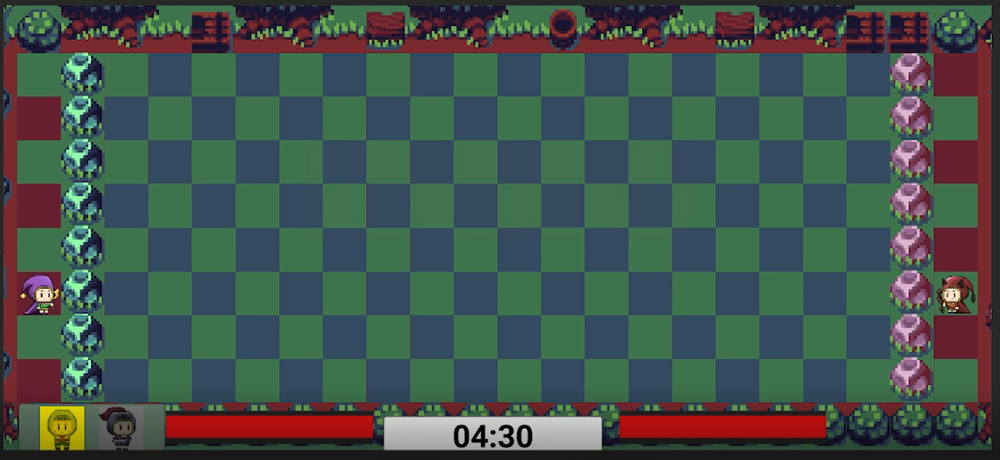

# Table of Contents
- link me to header 1
- link me to header 2
- link me to header 3
- link me to header 4

# Overview
- brief synopsis of the game, give a short elavator summary about the game
- brief synopsis of the gameplay

## Team Ideas
- Screen shot of the brains storm idea?

## Prototype

- put image with link to a channel that demonstrate the game
- include images??

## Final Product
- put image with link to a channel that demonstrate the game
- put the link to where the game is currently hosted in

## Team Members

### 1. [Marcos Buccat](https://buccatm.github.io/)

- ICS Student, Senior
- Include your individual Brainstoorm Documentation
- Implemented the Player Side:
  - Player movment
  - Player power ups
  - Player spells
  - Player Side summoning Units
- Implemented all of the player units behaviors
- Implemented the Win & Lose Conditions
- Implemented the Functionality of the Start, Win, and Lose scnene
 
### 2. Glen Larita
- URL of your home page
- Picture of your Team member
- State your standing and whether you are ICS or ACM
- Include your individual Brainstoorm Documentation
- Put Stuff that I did

### 3. Jestiny Lubas
- URL of your home page, linked in?
- Picture of your Team member
- State your standing and whether you are ICS or ACM
- Include your individual Brainstoorm Documentation
- Put Stuff that I did here

# Trello Board
- [Team Trello Board](https://trello.com/b/p0tyVYj3/sorcerer-duel)
